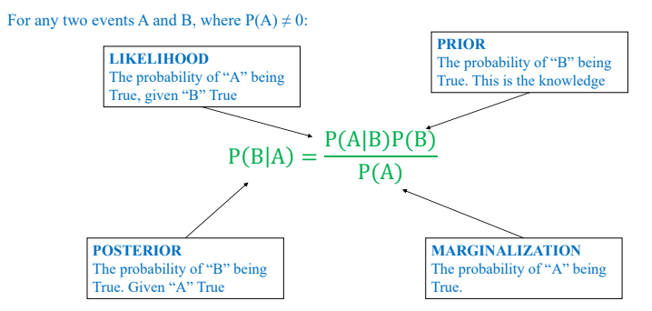

# Heart_Disease_Prediction
## **Overview**
Heart disease took the highest rank among reasons causing million of people died in 2019 (according to WHO). To be specific, common deadly affliction are blood vessel diseases, coronary artery disease, arrhythmias, ongenital heart defects and etc. There is no sign of reducing number of dead people, and the distribution categorized by ages has been expaned to youngters, leading the needs of tecnology to predict this illness as soon as possible.

The solution comming from this article cannot solve the world problem, but aim to try many appoarch to predict whether an individual gets a heart attrack or not.

This project focuses on building Hear Disease Prediction system based on different appoarch:
- KNN
- Navie Bayes
- Decision Tree
- Random Forest
- AdaBoost
- Gradient Boost
- XGboost
- Stacking method

The rest content of this article guide how to explain, set up, train and evaluate

## **Prerequisites**
Some libraies are necessary to install before joinning implementation:
```
pip install sklearn
pip install numpy
pip install pandas
```

Dataset: You can download from here: [cleveland.csv](https://drive.google.com/file/d/1zOj808OstnkaWlltM4qKNjjT3iT3yeMN/view)
## **Load data**
> cleveland.csv is a set of dataset collected from [UCI Machine Learning Repository](https://archive.ics.uci.edu/datasets)

Load and split trainning dataset

```
df = pd.read_csv('cleveland.csv', header=None)
df.columns = ['age', 'sex', 'cp', 'trestbps', 'chol',
              'fbs', 'restecg', 'thalach', 'exang',
              'oldpeak', 'slope', 'ca', 'thal', 'target']

df['target'] = df.target.map({0: 0, 1: 1, 2: 1, 3: 1, 4: 1})
df['thal'] = df.thal.fillna(df.thal.mean())
df['ca'] = df.ca.fillna(df.ca.mean())

X = df.iloc[:, :-1].values
y = df.iloc[:, -1].values

X_train, X_test, y_train, y_test = train_test_split(
    X, y, test_size=0.2, random_state=42
)
```

## **KNN**
*Define:* K-nearest Neighbors is a supervised learning machine learning algorithm used for classification and regression tasks. It works by finding the "k" neasest data points in training dataset to a given query point, and then making prediction based on labels or values of these neighbors.

*Steps:*
- Initialize the value of k
- Calculate the distance between test data and each row of training dataset
- Sort the calculated distance in ascending order based on distance values
- Get top k rows from the sorted array
- Get the most frequent class of these rows
- Return the predicted class

*Implementation:*
```
from sklearn.neighbors import KNeighborsClassifier

classifier = KNeighborsClassifier(
    n_neighbors=5,
    weights='uniform',
    algorithm='auto',
    leaf_size=30,
    p=2,
    metric='minkowski'
)
```
## **Support Vector Machine**
*Define:* Support Vector Machine is a supervised machine learning algorithm used for both classification and regression tasks. It is widely known for its effectiveness in high-dimensional spaces and its ability to handle both linear and non-linear classification problems. The primary goal of SVM is to find a hyperplane (or decision boundary) that best separates different classes in the feature space.

*Steps*
- Find the optimal hyperplane that maximizes the margin between different classes.
- Create Support Vectors: data points that lie closest to decision boundary and have a direct impact on its position and orientation

*Implementation:*
```
from sklearn.svm import SVC

classifier = SVC(
    kernel='rbf',
    random_state=42,
    C=0.6,
    gamma='scale',
)
```
## **Navie Bayes**
*Define:* Naive Bayes is a probabilistic algorithms based on Bayes' theorem. It's primarily used for classification tasks and works by making strong independece assumptions between the features.


*Steps:*
- Calculate the probability of each class given a set of features and selecting the class with the highest probability:
    + Calculate priors: calculate the prior probability for each class
    + Calculate likelihood: For each class, calculate the likelihood by assuming that each feature is independent.
    + Calculate posterior: combine the pirors and likelihoods using Bayes' theorem to get posterior.
    + Predict class: Assign the class with the highest posterior probability

*Implementation:*
```
from sklearn.naive_bayes import GaussianNB
classifier = GaussianNB()
```

## **Decision Tree**
*Define:* Decision Tree is a supervised machine learning algorithm used for both classification and regession tasks. It works by recursively splitting the data into subsets based on feature values, creating a tree-like model of decisions. Each nodes in the tree represents a decision point on a particular feature, each branch represents the outcome of the decision, and each leaf node represents the final prediction or classification.

*Steps:*
- Select the best feature as a root node: use Gini impurity or Information Gain to achieve
- Create Decision Nodes: Creation decision nodes for the chosen feature and split the dataset into subnets based on the feature's values
- Repeat Until Stopping Criteria: Continue creating new nodes for subnets recursively until:
    + Maximum tree depth is reached
    + Minimum number of sample in a node
    + No information gain can be achieved
- Assign leaf node with the most common class (classification) and average value (prediction)

*Implementation:*
```
from sklearn.tree import DecisionTreeClassifier

classifier = DecisionTreeClassifier(
    criterion='gini',
    max_depth=10,
    min_samples_split=2,
    random_state=42,
    ccp_alpha=0.0
)
```

## **Random Forest**
*Define:* Ranfom forest is an ensemble learning method that combines multiple trees to create a stronger and more robust model. It is primarily used for both classification and regression tasks. The main idea is to build a bunch of decision tree randomly and let them votes or average their predictions to make a final decision. This could prevent overfiting, increase accuracy and provide more stable predictions.

*Steps:*
- Bootstrap Sampling (Bagging): ramdonly create multiple subnets of training data (reduce variance)
- Random feature selection: at each split in the decision tree, a random subnet of features is selected, and only these features are considered for finding the best split
- Train multiple trees
- Vote:
    + Classification: the predicted class will be based on the most votes among trees
    + Prediction: the average of predictions made by all the trees is taken as the final result

*Implementation:*
```
from sklearn.ensemble import RandomForestClassifier

classifier = RandomForestClassifier(
    criterion='gini',
    max_depth=10,
    min_samples_split=2,
    n_estimators=10,
    random_state=42,
    min_samples_leaf=1,
    max_features='log2'
)
```

## **AdaBoost**
*Defines:* AdaBoost is an ensemble learning technique that combines multiple week learners to create a strong learner. It is primarily used for classfication tasks but also can be adapted regession. The key idea behind AdaBoost is to iteratively train a series of week learners called stumpts, and give more weights to misclassified instance in each iteration.

*Steps:*
- Initialize weights: 1/n with n as number of sample
- Train weak learners
- Calculate weighted error: sum of the weights of misclassified samples

Error = $(Σ(w_i*1(y_i ≠ h_t(x_i))))/(Σw_i)$

Where:
$w_i$: Weight assigned to the $i$-th sample.

$y_i$: True label of the $i$-th sample.

$h_t(x_i)$: Predicted label for the $i$-th sample by the $t$-th classifier.

$1(y_i ≠ h_t(x_i))$ : Indicator function that equals 1 if $y_i$ is not equal to $h_t(x_i)$, and 0 otherwise.

$n$: Total number of samples.


- Calculate model weights (amount of says):

$α_t = (1/2) * ln( (1 - Error) / Error )$

Where:

$α_t$: The weight associated with the $t$-th classifier.

$Error$: The error value calculated using the previous formula.

$ln$: The natural logarithm function.

- Update weights:

$w_i ← w_i * e^(α_t * 1(y_i ≠ h_t(x_i)))$

Where:
$w_i$: The updated weight for the $i$-th sample.

$α_t$: The weight associated with the $t$-th classifier.

$(y_i ≠ h_t(x_i))$: Indicator function that equals 1 if $y_i$ is not equal to $h_t(x_i)$, and 0 otherwise.

$e$: Euler's number (approximately equal to 2.71828).

- Repeat: Buid a next strump and update weights
- Final Prediction:

    + Classification: the final prediction is made by taking a weighted majority vote of all the week learners
    + Regression: the final prediction is the weighted sum of weak learners's predictions

*Implementation:*
```
from sklearn.ensemble import AdaBoostClassifier

classifier = AdaBoostClassifier(
    n_estimators=50,
    learning_rate=1.0,
    random_state=42
)
```

## **Gradient Boost**
*Define:* Gradient Boost is an essemble machine learning technique used for both classification and regression tasks. It builds a strong model by sequentially adding new decision tree that corrects the errors made by previous decision tree. Gradient Boost works by optimizing a loss function using a gradient descent appoarch

*Steps:*
- Initialize Decision Tree
- Calculate residuals (errors): the difference between the actual values and the current model predictions
- Establish a new decision tree
- Update model:

    $F_m(x) = F_(m-1)(x) + η * h_m(x)$

where:

$F_m(x)$: The current model after $m$ iterations.

$F_(m-1)(x)$: The previous model.

$η$: The learning rate.

$h_m(x)$: The new model fitted to the residuals.

- Repeat: Buid a next decision tree and update model

*Implementation:*
```
from sklearn.ensemble import GradientBoostingClassifier

classifier = GradientBoostingClassifier(
    n_estimators=100,
    subsample=1.0,
    min_samples_split=2,
    max_depth=3,
    random_state=42,
    learning_rate=0.1
)
```

## **XGboost**
*Define:* XGBoost is an optimized, high-performane implementation of the Gradient Boosting algorithm designed for speed and efficiency.

*Steps:*
- Initialize model that predicts a baseline value for all instances, typically the mean of the target variable (for regression) and log-odds (for classificaion)
- Establish a new decision tree
- Optimize a custom objective function that includes both the loss function and a regularization terms:

$Objective = Σ (L(y_i, ŷ_i)) + Σ (Ω(f_k))$

where:

$F_m(x)$: The current model after$`m$ iterations.

$F_(m-1)(x)$: The previous model.

$η$: The learning rate.

$h_m(x)$: The new model fitted to the residuals.

- Apply greedy learning and tree pruning methods
- Final prediction:
    + Classification: takes weighted majority vote across all trees.
    + Regression: takes average weights

*Implementation:*
```
from xgboost import XGBClassifier

classifier = XGBClassifier(
    objective="binary:logistic",
    random_state=42,
    n_estimators=100,
    learning_rate=0.1,
    max_depth=4
)
```

## **Stacking**
*Define:* Stacking is an essemble learning technique that combines multiple machine learning models (base learners) to improve the overall perfomance of the model

*Steps:*
- Train base learners: KNN, Decision Tree, Random Forest, ...
- Train meta-model: make final prediction based on the last model

*Implemention:*
```
from sklearn.ensemble import StackingClassifier

clf = [('dtc', dtc), ('rfc', rfc), ('knn', knn),
       ('gc', gc), ('ad', ad), ('svc', svc)]

classifier = StackingClassifier(
    estimators=clf,
    final_estimator=xg
)
```